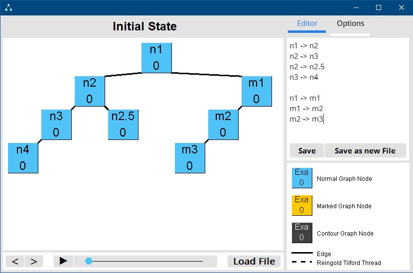
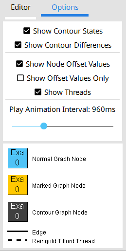
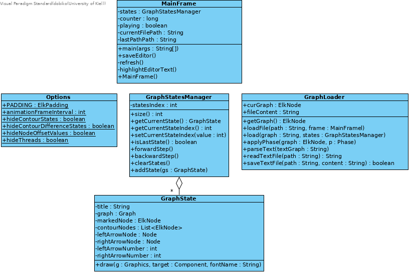
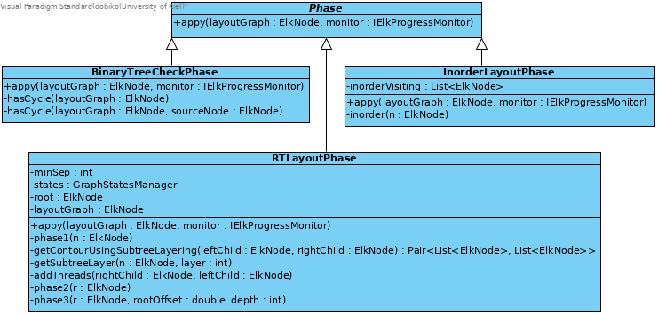
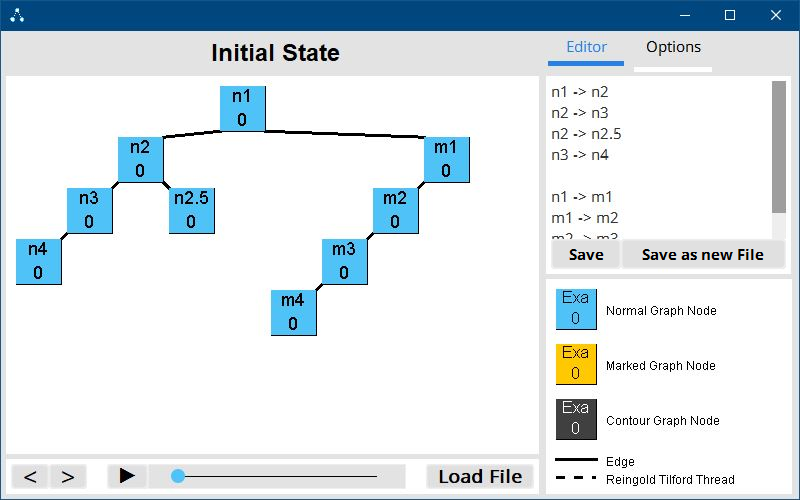
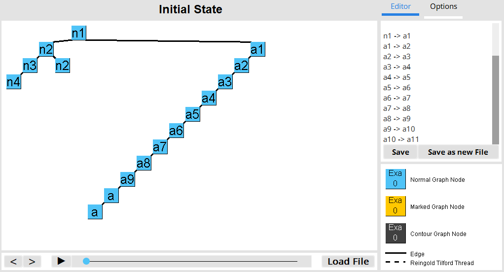
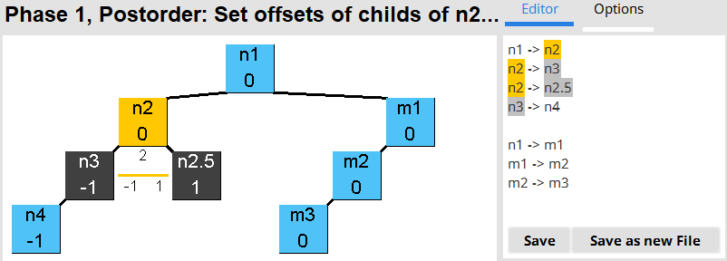
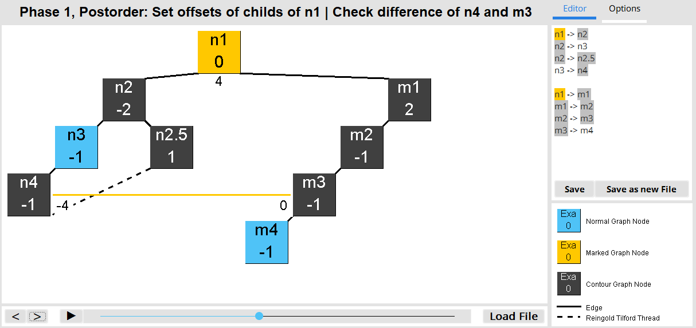
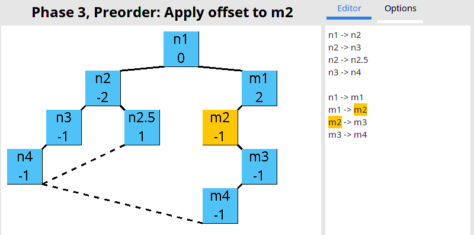

# Documentation

## Preamble

I moved the graph input format subsection from the technical section to the user guide because the user needs to know what kinds of graphs they can load to use the application.

Class diagrams in this Documentation will not include most generated methods in an efford to keep the diagrams in a readable size.

## User Guide

### Startup

After starting the application for the first time you should see this window. If you are running this program on Linux or Mac the title bar of the window might look different but that does not matter.


The first thing you want to do is to press the ``Load File`` button, this will load up the standart java swing file selector. With that you should select a text file that contains a valid graph. Do not worry though the program will remember the last file you selected so you won't have to go through all of your folders again.  
Alternatively you can also type a valid graph into the editor and hit ``CTRL + S``, ``Save`` or ``Save as new File``.  
The first two will write the graph into a temporary file while the latter lets you choose a filename and a folder for the new file the graph data should be saved in.

### Valid File Formats

A text file containing a valid graph only contains lines from  
a .elkt graph that do not contain { } blocks or  
simplified elkt edge definitions.
```
n1 -> n2
n1 -> n3

n2 -> n4
n2 -> n5

n3 -> n6
n3 -> n7
```
This is enough to describe a full binary tree with a depth of 2 in simplified elkt. Any node that appears in an edge is automatically added to the graph.
However as stated above .elkt files in this format work too:
```
algorithm: Trees 

layoutAlgorithm: 1

node n1
node n2
node n3 
node n4
node n6
node n7
node n8
node n9
node n10
node n11
node n12

edge n1 -> n2
edge n1 -> n3

edge n2 -> n4

edge n3 -> n6
edge n3 -> n7

edge n4 -> n8

edge n6 -> n9
edge n6 -> n10

edge n7 -> n11
edge n7 -> n12
```
And combinations of the two:
```
algorithm: Trees 

layoutAlgorithm: 1

node n1
node n2

edge n1 -> n2
edge n1 -> n3

n2 -> n4
```

### UI

After you loaded a graph the window should look something like this:



As you can see the UI is seperated into 4 main panes: 


#### Pane 1

The first pane is the drawPane, surprisingly the graph is drawn here. More interestingly however is the stateLabel above it that displays information about the current State. Remember to keep an eye on it while stepping through the algorithm states using the UI elements in pane 2.

#### Pane 2

The second pane contains 3 groups of UI elements that are seperated by empty spaces.  
To the very left we got arrow buttons that allow us to step though the animation states frame by frame in each direction. They act like a ring buffer so trying to move backwards on the initial frame will move you to the last state.  
In the middle there are a play/pause button and a slider that is misused as a progress bar for the animation. It works very similar to a YouTube video bar.  
To the right there is the load button that we already used to load this graph.

#### Pane 3

##### The Editor

This pane contains tabs, the default shown tab is the editor tab which contains a text editor that shows the source code of the currently loaded graph. Hitting `CTRL + S` while the tab is focused or the `Save` button will save the changes you made in that editor to the loaded text file and reload it.  
Don't move or delete a text file that is currently loaded.

Also noteworthy is a simple syntax highlighter that highlights the currently marked node and contour.


##### The Options Menu 



The options menu currently contains 5 level of detail options and an animation interval slider. 
They are grouped by seperators. The first two options hide animation states, the three in the middle are drawing options and the last one is for animation options.

The first option shows or hides all states that show the contour. 
The second option shows all states that show the distance check on each contour layer.
The third option shows the xOffset values that the algorithm saves for each node. They are displayd below the nodes name. 
The fourth only shows the offset value for each node.
The fifth option hides threads which are displayed as dashed lines.

Some of these options disable other options. Disabling `Show Node Offset Value` and enabling `Show Offset Values Only` doesn't make any sense.
Therefore some options disable others.


The legend also immediately shows changes in the options.

#### Pane 4

The fourth pane contains a legend for the graph drawing in the first pane. If this UI element does it's job it should be self explanatory. 

## The Software behind the UI

### Dependencies

The project is written using JavaSE-1.8 and Maven. I imported and used the Maven packages `org.eclipse.elk.graph`, `org.eclipse.elk.alg.common` and `material-ui-swing`. The latter one contains a Java Swing Look and Feel that was inspired by Googles Material Design.

### Program Architecture

The code of this project is split into 3 packages:
* graph.drawing.RTProject
  + Contains classes that are specific to this project
* helper
  + Contains classes that support other calculations, most of the classes in this package have been imported from the last assignment
* phases
  + Contains some layout phase classes from the last assignemnts, most notably a modified version of the RT layout phase.

### graph.drawing.RTProject



#### MainFrame

This class was with the exception of the code inside some events mostly generated using the WindowBuilder Plugin and its attributes are the GUI elements shown in the previous chapter.
This class also contains the entry point for this application.

#### GraphStatesManager

This class manages a list of GraphStates and the index of the currently displayed one.

#### GraphState

This class holds all the information nessecary to visualize a state in the RT algorithm. The left and right arrow attributes may be confusing, they contain all the nessecary information to draw the line that symbolises the check of the contour difference.  
The class also contains the draw method which draws this state to a target component.
I left the numerous constructors and some draw methods out in this diagram.

#### GraphLoader

This class contains the nessecary methods to read, parse, check and update the GraphStates in the GraphStatesManager.

#### Options

This class contains final and non final options for the program. The non final ones can be changed in the options tab in the GUI.

### helper


#### Graph

This class is used to clone an Elk Graph using the fromElk() method so a GraphState can get a copy of the graph.

#### Node

This class mirrors an ElkNode and additionally also contains a RT thread pointer.

#### Edge

This class mirrors an ElkEdge.

#### Help

This class contains a lot of helpful michellenious methods that are grouped in the code by comments.

#### NodeProperty

An instance of this class is saved for almost every ElkNode and contains needed additional information for the BinaryCheckPhase and the RTLayoutPhase.
Getting a pointer to an instance of this class using the Help.getProp() method is somewhat shorter than managing Elk Properties normally which is why I use this wrapper.

### phases



#### Phase 

This is the superclass for all phase classes in this package. It defines an apply method that gets a reference to an ElkNode that contains a graph and a ProgressMonitor.

#### BinaryTreeCheckPhase

This is a Phase that throws an Exception if the apply method is called on a graph that isn't a binary tree. This Phase is applied before the other Phases in GraphLoader.load().

#### InorderLayoutPhase

This is a Phase that layouts a graph using the inorder algorithm. It is used to create the initial state of the graph.

#### RTLayoutPhase

This is a layout phase that layouts the graph using a RT implementation. However this phase is modified to additionally create GraphState instances of the current progress and add them to the GraphStatesManager.

## Visualization

### GUI



The left side of the GUI is designed similarly to a generic video player with the play plause button and the progress bar showing the progress through the video. However we also need buttons to step through the animation frame by frame. Similarly to Sony Vegas' GUI I seperate the video player controls from the frame by frame buttons.

The right side of the GUI contains additional information like the legend, similarly to YouTubes info panel that are enabled on certain videos. 

Within the editorTab there is some padding around the editorPane because the text would otherwise start directly next to the background.  

### Filtering



If there is not enough space for the Node name and its offset value to be drawn the program will draw the node name only to keep it readable.

### Initial Phase

In the initial state the graph is layouted using the inorder algorithm because it tends to layout graphs too widely which gives us enough space to visualize the stages of the RT algorithm.

### Phase 1



In the first phase of the RT algorithm we step through the graph in postorder, check contours and set the offset values for each node except the root.

Firstly to make clear in what order we stepping through the graph currently and what phase we are in this information is always displayed in the stateLabel before the `:`.

To show what node we are looking at in the current step the node is marked in an orange color. Due to the fact that this color is a warning color that should make it easy to see that this node is important in the current step.

To emphasize nodes that belong to the contours that are currently checked, those nodes are drawn in a kind of negative. The negative color of cyan is unfitting though so I used gray. That gray tone also fits well with the orange tone of the marked node.

The layer of the currently checked contour difference is displayed by a line between the two nodes. Below that line at each side the actual contour value is drawn.

Due to the fact that the contour number and the threads might overlap the background of the contour number is cleared.
Overlaps between thread lines and contour difference lines shouldn't be so confusing because they are drawn in different colors.

When the difference line is drawn the dv value of the algorithm is drawn below the marked node to visualize that it's the horizontal difference between the two subtrees under it.



Threads that are created during this phase are displayed as dashed lines similarly to how they were drawn in the paper from Reingold and Tilford that first proposed the RT algorithm.
Unlike edges however that are drawn from and to the edges of the nodes rectangle that are the closest to each other, the threads are routed always from and to the lower sides of the rectangle to prevent overlaps.

### Phase 2


This phase is a lot simpler than the first one. All we do is finding the roots X position within the grid by stepping through its left children recursively.
We mark the node we are currently visitig again and show the currently accumulated X position in the title.

### Phase 3



In this phase we step through the graph in Preorder and set the nodes X positions based on the offsets we calculated earlier. 
The node we are currently processing is marked again and the order is displayed in the title. 