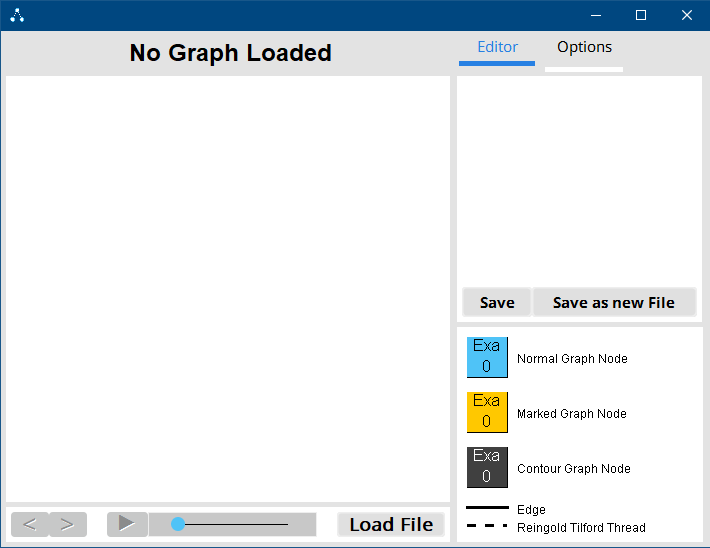
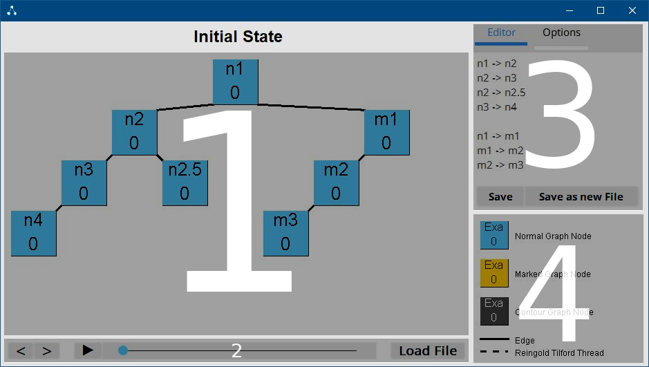
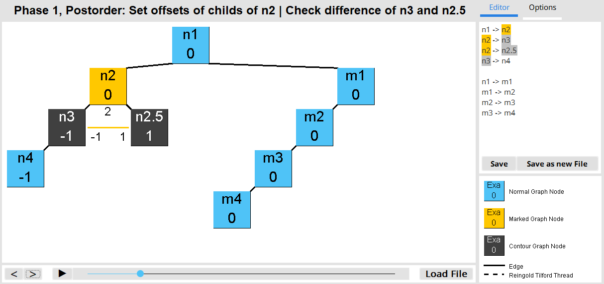

# Documentation

## User Guide

### Startup

After starting the application for the first time you should see this window. If you are running this program on Linux or Mac the title bar of the window might look different but that does not matter.


The first thing you want to do is to press the ``Load File`` button, this will load up the standart java swing file selector. With that you should select a text file that contains a valid graph. Do not worry though the program will remember the last file you selected so you won't have to go though all of your folder twice.  
Alternatively you can also type a valid graph into the editor and hit ``CTRL + S`` or ``Save``.

### Valid File Formats

A text file containing a valid graph only contains lines from a .elkt graph that do not contain { } blocks or simplified elkt edge definitions.
```
n1 -> n2
n1 -> n3

n2 -> n4
n2 -> n5

n3 -> n6
n3 -> n7
```
This is enough to describe a full binary tree with a depth of 2 in simplified elkt. Any node that appears in an edge is automatically added to the graph.
However as stated above .elkt files in this format work too:
```
algorithm: Trees 

layoutAlgorithm: 1

node n1
node n2
node n3 
node n4
node n6
node n7
node n8
node n9
node n10
node n11
node n12

edge n1 -> n2
edge n1 -> n3

edge n2 -> n4

edge n3 -> n6
edge n3 -> n7

edge n4 -> n8

edge n6 -> n9
edge n6 -> n10

edge n7 -> n11
edge n7 -> n12
```
And combinations of the two:
```
algorithm: Trees 

layoutAlgorithm: 1

node n1
node n2

edge n1 -> n2
edge n1 -> n3

n2 -> n4
```

### UI

After you loaded a graph the window should look something like this:


As you can see the UI is seperated into 4 main panes: 



#### Pane 1

The first pane is the drawPane, surprisingly the graph is drawn here. More interestingly however is the stateLabel above it that displays information about the current State. Remember to keep an eye on it while stepping through the algorithm states using the UI elements in pane 2.

#### Pane 2

The second pane contains 3 groups of UI elements that are seperated by empty spaces.  
To the very left we got arrow buttons that allow us to step though the animation states frame by frame in each direction. They act like a ring buffer so trying to move backwards on the initial frame will result in landing in the last frame.  
In the middle there are a play/pause button and a slider that is misused as a progress bar for the animation. It works very similar to YouTube video bar.  
To the right there is the load button that we already used to load this graph.

#### Pane 3

##### The Editor

This pane contains tabs, the default shown tab is the editor tab which contains a text editor that shows the source code of the currently loaded graph. Hitting `CTRL + S` while the tab is focused or the `Save` button will save the changes you made in that editor to the loaded text file and reload it. Don't move or delete a text file that is currently loaded.

Also noteworthy is a simple syntax highlighter that highlights the currently marked node.



##### The Options Menu


The options menu currently contains an animation interval slider and 4 level of detail options.  

The first one hides all animations states that show how the contour was calculated, if activated this also activates the second option.  
The second option hides all states that show the distance check on each contour layer.  
The third option hides the xOffset values that the algorithm saves for each node. They are usually displayd below the nodes name.  
The fourth option hides threads which are usually displayed as dashed lines.

#### Pane 4

The fourth pane contains a legend for the graph drawing in the first pane. If this UI element does it's job it should be self explanatory. 

## The Software behind the UI

The code of this project is split into 4 packages:
* graph.drawing.RTProject
  + Contains classes that are specific to this project
* helper
  + Contains classes that support other calculations, most of the classes in this package have been imported from the last assignment
* phases
  + Contains some layout phase classes from the last assignemnts
* properties
  + Contains classes that are instanced as properties for Elk classes. This isn't nessecary but shortens the code because accessing the property class instances is shorter.

### graph.drawing.RTProject


#### MainFrame

This class was with the exception of some events generated using the WindowBuilder Plugin and its attributes are the GUI elements shown in the last chapter.

#### GraphStatesManager

This class manages a list of GraphStates and the index of the currently displayed one.

#### GraphState

This class holds all the information nessecary to visualize a state in the RT algorithm. The left and right arrow attributes may be confusing, they contain all the nessecary information to draw the line that symbolises the check of the contour difference.  
The class also contains the draw method which draws this state to a target component.

#### GraphLoader

This class contains the nessecary methods to read, parse, check and update the GraphStates in the GraphStatesManager.

#### Options

This class contains final and non final options for the program. The non final ones can be changed in the options tab in the GUI.

### helper

